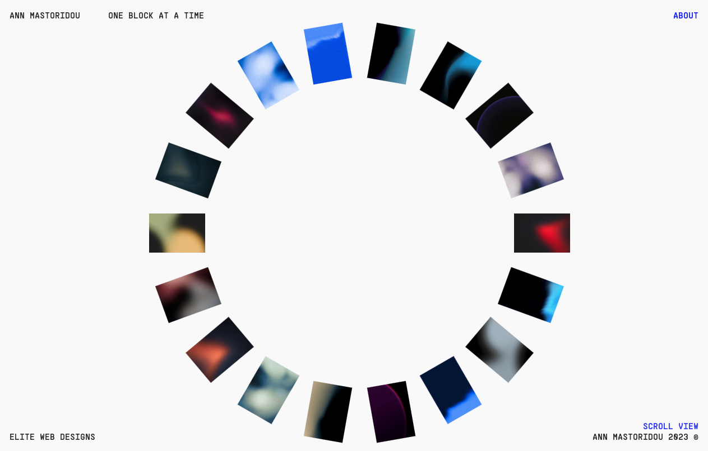

# Ethereal Wallpapers Gallery

This project showcases the mesmerizing Ethereal Grainscapes Wallpapers by digital artist Ann, providing an immersive gallery experience. Implemented using HTML, CSS, and JavaScript, this static website leverages GSAP (GreenSock Animation Platform) for seamless animations, enhancing user engagement.

## Skills Used
- HTML
- CSS
- JavaScript
- Responsive Design
- GSAP
- Web Development
- UI/UX

## Highlights
- Utilized GSAP for smooth animations, elevating user interaction.
- Optimized high-resolution images while ensuring mobile compatibility.
- Created an intuitive and visually appealing interface to showcase artwork effectively.
- Integrated responsive design principles for seamless viewing across devices.

## Overview
This project amalgamates technical expertise in web development with a keen eye for user experience, resulting in an engaging platform that highlights the artist's talent in a captivating manner.

## Viewing Modes
The gallery offers two viewing modes:
1. *Wheel View*
2. *Scroll View*

## Live View
For a live view of the project, click [here](https://ann-ethereal-wallpapers.netlify.app).

## Tools Used
- CSS3
- Visual Studio Code
- Adobe Photoshop
- HTML5
- JavaScript
